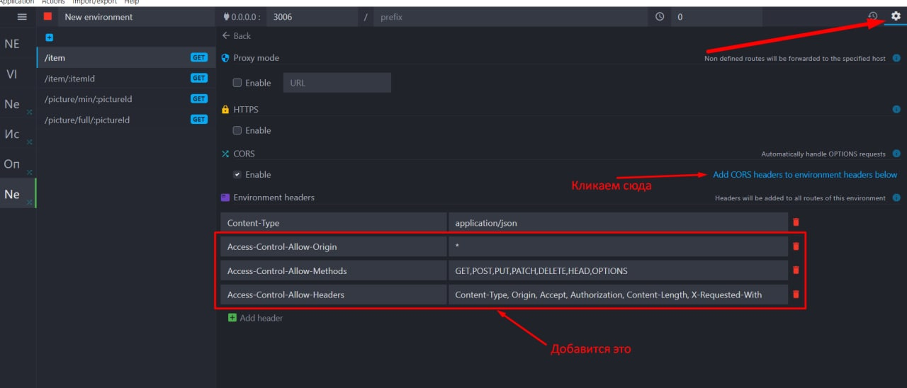
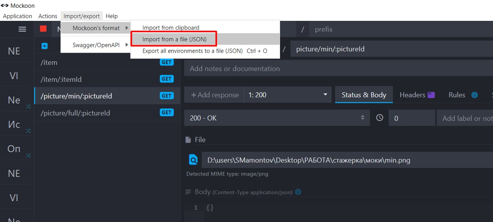
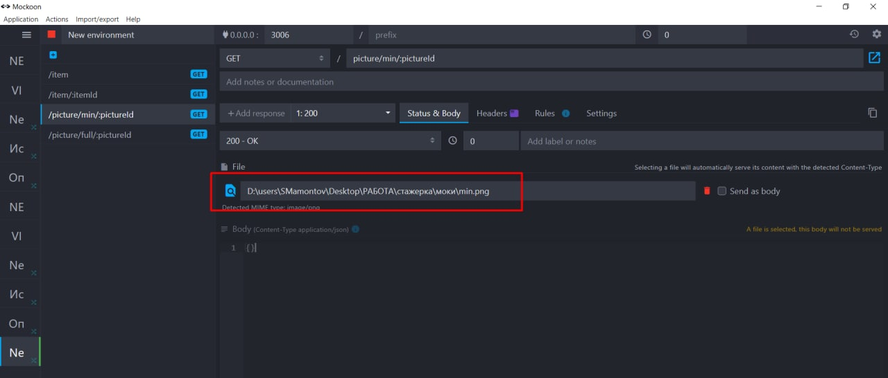
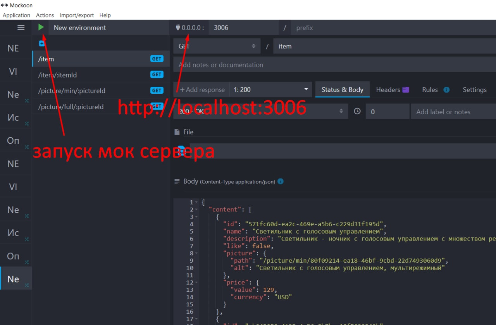

# ibs-react-app
Приложение магазина, в котором можно:
1. Посмотреть список товаров
2. Перейти на страницу к конкретному товару при клике на него
3. Также работает строка поиска, которая фильтрует товары в режиме реального времени

Чтобы развернуть приложение у себя на компьютере:
1. Мок сервер, скачать, поставить - https://mockoon.com/
2. Чтобы избежать ошибки CORS (т. к. js файл лежит на диске, а не на дев сервере) делаем настройки как на скрине 1

3. Импорт мока - см. скрин 2 (архив с json для импорта и картинками лежит в папке "моки")

4. В урлах для получения изображений надо указать расположение файла у себя на диске (см. скрин 3)

5. Запустить мок-сервер (см. скрин 4)

# Основные команды

### `yarn install`
Установить зависимости в проекте

### `yarn start`
Запустить проект в режиме разработки

### `yarn build`
Сделать билд проекта
